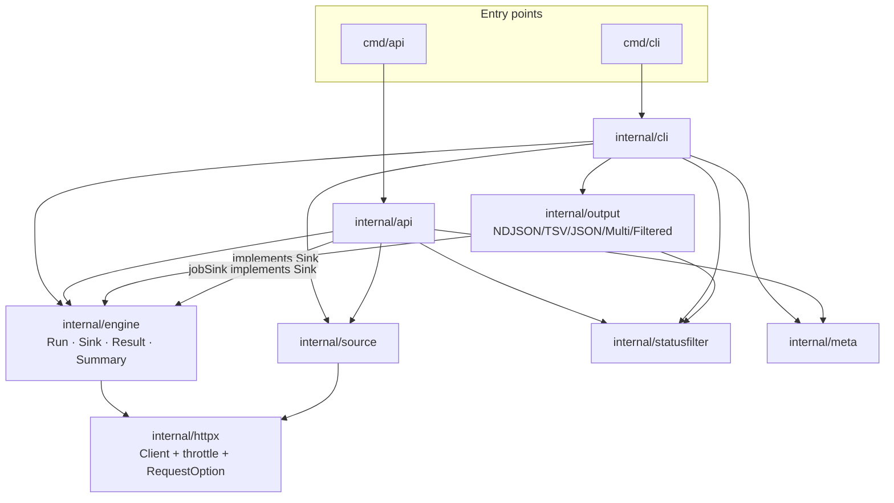
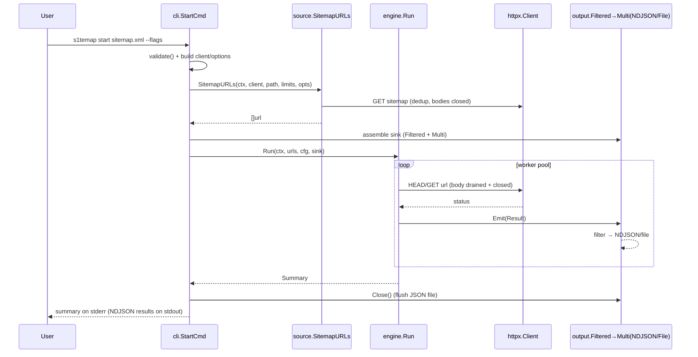
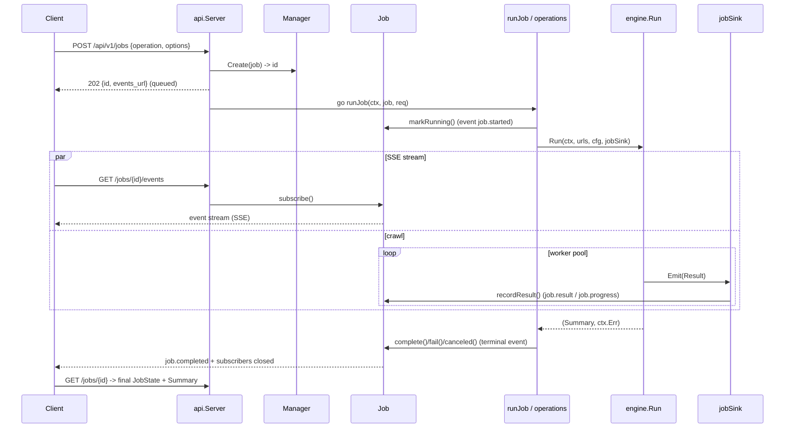

# s1temap — Technical Design

This document describes the architecture of the s1temap sitemap crawler. It
covers the main entities, their relationships, the data flow, the
concurrency/resource guarantees, and a guide for extending the system.

> Scope: everything here refers to the Go module rooted at the repository root
> (`preditrix/s1temap`).

---

## 1. Purpose

s1temap crawls a set of URLs — discovered from a **sitemap** or read from a
**URL list** — to warm caches, measure response times, and find dead pages. It
ships two front-ends over one engine:

- a **CLI** (`cmd/cli`),
- an **HTTP API** (`cmd/api`) with async jobs and Server-Sent Events (SSE).

## 2. Goals & non-goals

**Goals**
- One crawl engine shared by CLI and API.
- A **minimal** set of clean abstractions — no speculative extensibility.
- Correctness: no data races, no leaked HTTP bodies / file descriptors, no
  process-killing `log.Fatal` inside library code.
- Preserve the full legacy feature set (commands, flags, output formats, API
  surface).

**Non-goals**
- A plugin framework or a large interface hierarchy.
- Persisting jobs (the API job store is in-memory by design).

## 3. Problems this design fixes (vs. the legacy engine)

| Legacy problem | Fix |
|---|---|
| Data race on lazy `statusFilter` init | `statusfilter.Filter` compiled once, immutable, concurrency-safe |
| Unclosed `resp.Body` / files (leaks) | every body drained + closed; every file closed |
| `log.Fatal` inside worker goroutines | functions return errors; only the top layer decides to exit |
| Hand-rolled JSON + O(n²) file rewrite | `encoding/json`; `JSONArrayFile` writes once on `Close` (O(n)) |
| Fragile worker pool (WaitGroup counts requests) | idiomatic pool: producer closes channel, workers range, one `WaitGroup` |
| Per-worker idle throttle; API never clamps | global throttling `RoundTripper` in the HTTP client (CLI + API) |
| Unbounded recursion on cyclic sitemap index | `source` walker uses a visited set + `MaxDepth/MaxSitemaps/MaxURLs` |
| Duplicated modifiers / filters / parsers / strip helpers | one canonical implementation of each |
| Two result paths (`OnResult` + internal logging) | a single `engine.Sink` path |

## 4. Layering & dependency rule

Dependencies point **inward**, toward the engine. Outer layers (CLI, API) depend
on the core; the core never imports them.

```
cmd/cli     ─┐                       ┌─ cmd/api
             ▼                       ▼
        internal/cli            internal/api
             └──────────┬───────────┘
                        ▼
   ┌──────────── internal/engine ────────────┐   core: Run, Result, Summary, Sink
   ▼              ▼             ▼              ▼
 httpx        source        output       statusfilter
   │             │
   └── meta (version / User-Agent), shared by all
```

`output` and `api.jobSink` **implement** `engine.Sink`, so front-ends attach
their own output without the engine knowing any concrete sink type.

## 5. Module layout

```
.                                 repository root
  go.mod                          module preditrix/s1temap  (deps: kong, etree)
  cmd/cli/main.go                 CLI entry -> cli.Run()
  cmd/api/main.go                 API server entry (LISTEN env)
  internal/meta/version.go        Version / UserAgent (ldflags)
  internal/httpx/
    client.go                     NewClient(timeout, insecure, idle) + throttling transport
    options.go                    RequestOption + WithUserAgent/BasicAuth/Cookies/Headers/PrefixURL
  internal/statusfilter/filter.go Parse(query) -> *Filter, Filter.Match(status)
  internal/source/
    sitemap.go                    SitemapURLs (dedup + Limits, cycle-safe, closes resources)
    urllist.go                    ListURLs
    striputil.go                  StripBaseURLs
  internal/engine/
    result.go                     Result, Summary, Sink
    engine.go                     Run(ctx, urls, Config, Sink) (Summary, error)
  internal/output/
    sink.go                       Multi, Filtered, marshalResult
    ndjson.go tsv.go jsonarray.go NDJSON / TSVFile / JSONArrayFile sinks
  internal/cli/
    run.go commands.go flags.go crawl.go logging.go   Kong grammar + orchestration
  internal/api/
    server.go manager.go operations.go types.go       HTTP server + jobs + SSE
```

## 6. Architectural entities

### 6.1 `engine` — the core
- **`Config`** — `Workers`, `Method` (`"HEAD"` — the default when empty — = HEAD
  with GET fallback on 400/403/405/501; `"GET"` = GET only), `Client
  *http.Client`, `Options []httpx.RequestOption`, and `HeartbeatEvery int` +
  `OnHeartbeat func(Summary)` (when `HeartbeatEvery > 0`, `Run` calls
  `OnHeartbeat` with a snapshot of the running `Summary` every N processed URLs;
  calls are serialized).
- **`Run(ctx, urls, cfg, sink) (Summary, error)`** — bounded worker pool. A
  producer feeds URLs into a channel and closes it; `Workers` goroutines drain
  it; a single `WaitGroup` joins them. Cancelling `ctx` stops the run. Each URL
  produces exactly one `Result`, passed to `sink.Emit`. Returns a `Summary` and
  `ctx.Err()`.
- **`Result`** — `URL, Status, Method, Fallback, HeadStatus, Duration, Err,
  Timestamp`.
- **`Summary`** — `Total, Errors, ByStatus, SumDuration, StartedAt, EndedAt,
  Duration`. Counts **every** result regardless of output-side filtering. Its
  `WriteSummary(io.Writer)` renders the human-readable summary block (used by the
  CLI for the final summary and heartbeats).
- **`Sink`** — the only engine interface: `Emit(Result)` (called concurrently
  from workers — implementations must be safe) and `Close() error`.

### 6.2 `httpx` — HTTP construction
- **`RequestOption func(*http.Request)`** — the single canonical way to
  customize requests. Constructors: `WithUserAgent`, `WithBasicAuth`,
  `WithCookies`, `WithHeaders`, `WithPrefixURL`. `Apply(req, opts...)` runs them.
- **`NewClient(timeout, insecure, idle)`** — builds an `*http.Client`. When
  `idle > 0`, wraps the transport in a **throttling `RoundTripper`** that spaces
  *any* two requests at least `idle` apart, globally (mutex reserves a time slot,
  the caller sleeps outside the lock and respects `ctx`).

### 6.3 `statusfilter` — status matching
- **`Parse(query) (*Filter, error)`** compiles a comma-separated OR query
  (`200`, `!200`, `500-599`, `200,404`, `>500`, `<300`; empty = match all) once
  into predicates. **`Filter` is immutable** → safe to share across goroutines.
- **`Filter.Match(status) bool`**.

### 6.4 `source` — URL sources
- **`SitemapURLs(ctx, client, root, Limits, workers, opts...)`** — fetches the
  root sitemap (http(s) or file), walks nested indexes with a **visited set**
  (cycle-safe), honoring `Limits{MaxDepth, MaxSitemaps, MaxURLs}`. Nested sitemap
  documents are fetched **concurrently**, bounded by `workers` (via
  `errgroup.SetLimit` + `TryGo`-or-inline, so live goroutines stay ≤ `workers`
  and there is no bounded-recursion deadlock). Each `walk` appends its page URLs
  to a shared slice under a mutex as documents complete, so **result order is
  not guaranteed**. `MaxURLs` is applied as a final truncation of that
  (unordered) slice — it keeps an arbitrary subset and no longer short-circuits
  fetching, so pair it with `MaxSitemaps` to bound work. Root fetch failure is
  returned; nested failures are logged and skipped. All bodies/files are closed.
- **`ListURLs(ctx, client, path, opts...)`** — reads a newline-delimited list.
- **`StripBaseURLs(urls)`** — shared "path-only" helper for CLI tools and API.

### 6.5 `output` — sinks (implement `engine.Sink`)
- **`NDJSON`** — one JSON object per line to an `io.Writer` (stdout).
- **`TSVFile`** — `status|err \t url \t unixSeconds \t <ms>ms`.
- **`JSONArrayFile`** — buffers records, writes one pretty JSON array on
  `Close()` (O(n)).
- **`Multi`** — fan-out to several sinks.
- **`Filtered(inner, *statusfilter.Filter)`** — forwards only matching results;
  the engine still counts everything, so the summary stays complete while output
  is filtered.
All sinks are concurrency-safe (internal mutex).

### 6.6 `cli` — CLI front-end (Kong)
- **`CLI`** — root grammar: `StartCmd` (`start <sitemap>`), `ListCmd`
  (`list <url-list>`), `ToolsCmd` (`tools convert-sitemap-to-urllist`), plus
  `--version`.
- **`crawlFlags`** — shared flags (`--num-workers`, `--method`,
  `--heartbeat-every`, `--http-timeout`, `--idle-timeout`, `--prefix-url`,
  `--auth-user/-pass`, `--cookie`, `--header`, `--user-agent`, `--filter-status`,
  `--output-file`, `--output-json`, `--insecure`); provides `validate()`,
  `client()`, `options()`.
- **`runCrawl(...)`** — orchestration: clamp idle→1 worker (with a warning),
  drop host-relative paths without `--prefix-url` (logged to stderr), assemble
  the sink (`Filtered` over `Multi{...}` or NDJSON), call `engine.Run`, and write
  the final summary. Both the final summary and the `--heartbeat-every` progress
  (wired to `engine.OnHeartbeat`) are printed to **stderr** via
  `engine.Summary.WriteSummary`, so per-URL NDJSON on stdout stays clean.
- **logging** — split handler (info/debug→stdout, warn/error→stderr); level from
  `SMAP_LOG_LEVEL`.

### 6.7 `api` — HTTP front-end
- **`Server`** — routes `/healthz`, `/version`, `/api/v1/jobs...`, SSE, CORS.
- **`Manager`** — in-memory job registry guarded by `RWMutex`.
- **`Job`** — one job's state, SSE subscribers, and counters; all mutations
  (`markRunning`, `recordResult`, `setProgress`, `complete/fail/canceled`) under
  its mutex; a full-buffer subscriber drops events (non-blocking).
- **`jobSink`** — implements `engine.Sink`; maps each `engine.Result` to
  `api.Result` and calls `Job.recordResult`, marking `visible` via the filter.
- **`operations`** — `crawl_urls`, `crawl_sitemap`, `convert_sitemap_to_urllist`;
  maps `CrawlOptions` to `engine.Config` and `source.Limits`. `Method`,
  `MaxDepth`, `MaxSitemaps`, `MaxURLs` are now actually applied.

### 6.8 `meta`
Build-time `Version` / `GitCommit` (ldflags) and `UserAgent()`.

## 7. Component diagram



## 8. Interaction — CLI `start <sitemap>`



## 9. Interaction — API async job



## 10. Concurrency & resource safety

- **Worker pool**: single producer closes the job channel; workers `for range`
  it; one `WaitGroup`. No request-counting; no negative-counter panics.
- **Cancellation**: `ctx` threads through the producer send, the throttle wait,
  and every HTTP request. The CLI cancels on SIGINT/SIGTERM (so the sink is still
  `Close`d — the JSON file is flushed); the API cancels per job via
  `/jobs/{id}/cancel` and shuts the server down gracefully on a signal.
- **Shared state**: engine summary under a mutex; sinks under mutexes; API `Job`
  under its mutex; `Manager` under `RWMutex`; `statusfilter.Filter` immutable;
  the sitemap `walker`'s `seen` set, `sitemaps` counter, and collected `urls`
  slice under a mutex (parallel discovery).
- **Resources**: every HTTP response body is drained and closed (keep-alive
  reuse), every file is closed. No `log.Fatal` in library code.
- **Rate limiting**: global via the client's throttling transport, independent
  of worker count — identical behavior for CLI and API.

Run the race detector where a C compiler is available:
`CGO_ENABLED=1 go test -race ./...`.

## 11. Extension guide

**Add a new output format** → implement `engine.Sink` (`Emit` + `Close`) in
`internal/output`, then wire it in `cli.buildSink`. Reuse `marshalResult` for
the JSON shape; guard shared state with a mutex.

**Add a new URL source** → add a function in `internal/source` returning
`([]string, error)` (close every resource you open), then call it from a command
before `engine.Run`.

**Add a new CLI command** → add a struct with Kong tags and a `Run() error`
method in `internal/cli/commands.go`, embed `crawlFlags` if it crawls, and
register it in the `CLI` struct in `run.go`.

**Add a new API operation** → add an `Operation` constant and a `run*` function
in `internal/api/operations.go`, dispatch it in `runJob`, and validate it in
`validateJobRequest`. Reuse `Server.crawl` + `jobSink` to feed results into the
`Job`.

**Add a request customization** → add a `WithX` constructor in
`internal/httpx/options.go`; include it in `crawlFlags.options()` (CLI) and
`api.pageOptions/fetchOptions` (API).

## 12. Build, run, test

```bash
# from the repository root
go build ./...
go vet ./...
go test ./...
CGO_ENABLED=1 go test -race ./...          # needs a C toolchain

go run ./cmd/cli start ./sitemap.xml       # CLI
LISTEN=:8080 go run ./cmd/api              # HTTP API
```

CLI logging verbosity: `SMAP_LOG_LEVEL` = `debug|info|warn|error` (default
`debug`); debug/info go to stdout, warn/error to stderr.
